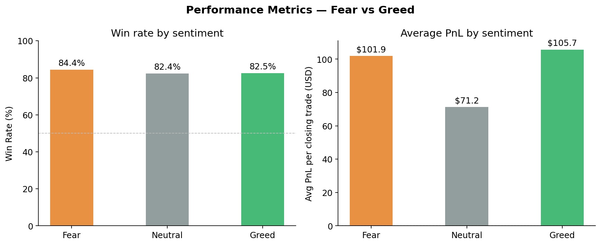
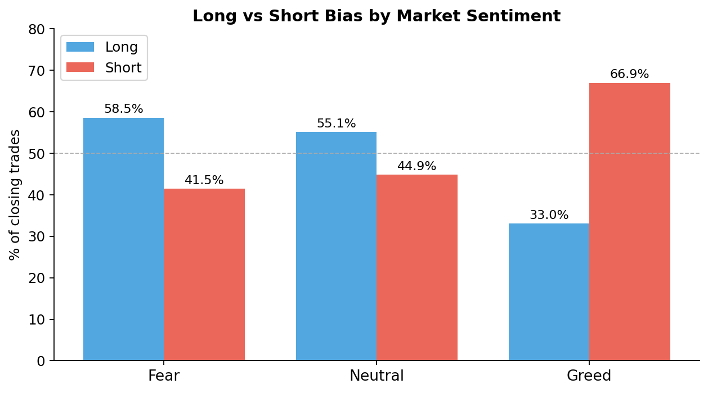
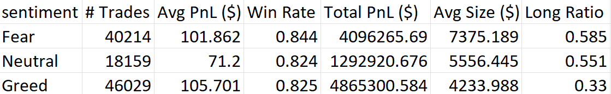
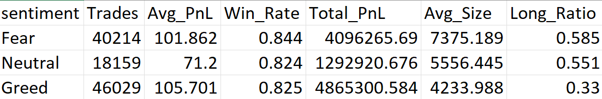

# Analysis Summary

This project analyzes how Bitcoin market sentiment (Fear vs Greed) affects trader behavior and performance on Hyperliquid using historical trade data and the Fear & Greed Index.
The first step was cleaning and preparing both datasets. The trader dataset contained more than 211,000 trades across 32 accounts, while the sentiment dataset provided daily Fear & Greed classification. 

The first major finding came from the performance comparison chart (Win Rate and Average PnL). Fear days showed the highest win rate at 84.4%, while Greed days had a slightly lower win rate of 82.5%. However, average PnL per trade remained very similar between Fear and Greed days. This suggests that trader profitability does not change drastically with sentiment, but trading decisions and behavior do.

The second important insight came from the Long vs Short Bias chart. During Fear days, traders were long in 58.5% of trades, while during Greed days, the long ratio dropped to only 33%. This shows strong contrarian behavior. Instead of following market sentiment, traders often took the opposite side. Fear created buying opportunities, while Greed encouraged more short positions.

The Position Size and Trade Frequency chart showed another strong behavioral shift. During Fear days, average position size increased significantly to around $7,375 compared to only $4,234 during Greed days. This indicates that traders were more aggressive during fear-driven volatility and more selective during greed-driven conditions.
Trader segmentation analysis showed that frequent traders and larger position traders generally performed better than infrequent or smaller traders. Consistent winners were not necessarily the highest leverage traders, but traders who adjusted size and direction based on market conditions.

Based on these findings, two strategy ideas are recommended.

First, during Fear days, increasing long exposure with controlled leverage may be beneficial, especially for experienced traders. Since win rate is highest during Fear and traders tend to buy during panic, Fear can be treated as an opportunity rather than a warning signal.

Second, during Greed days, reducing position size and avoiding aggressive longs may improve consistency. Since traders become more short-biased during Greed and profits do not increase significantly, smaller and more precise trades appear to be the better strategy.

Finally a simple predictive model can be built using sentiment, trade size, and trade frequency to predict next-day profitability buckets. A lightweight Streamlit dashboard is added to make exploration of trader segments and sentiment-based behavior more interactive.
